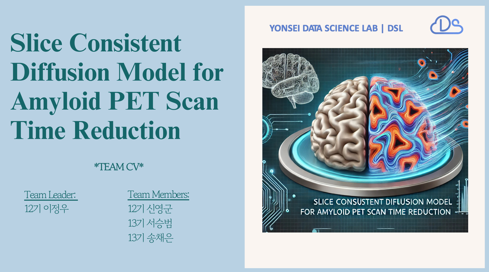
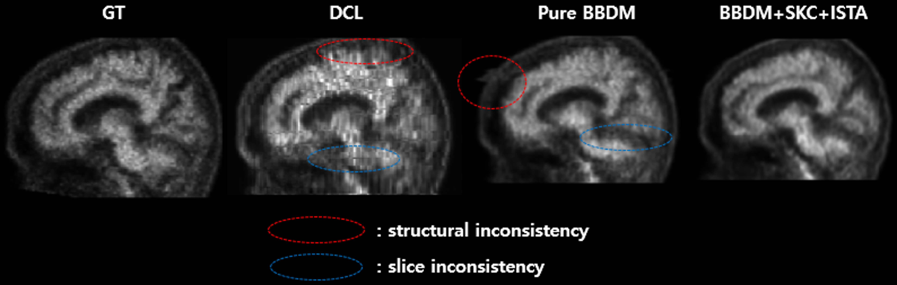
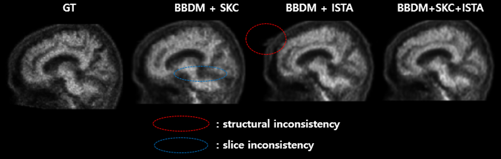
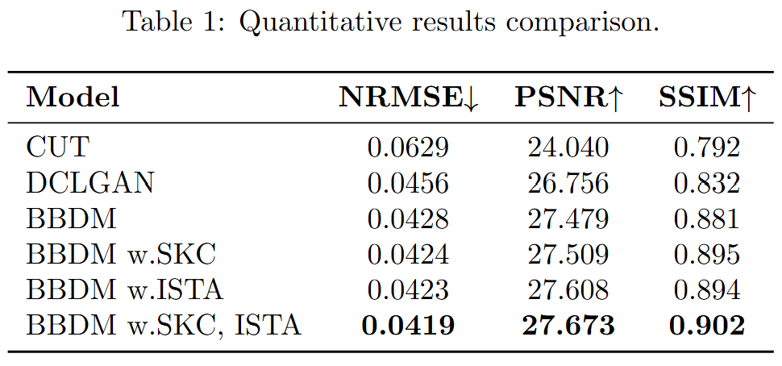

# SCOPE: Slice-COnsistent PET Reconstruction with 2D BBDM

> This project was conducted by the **Computer Vision team** as part of the 2025 Spring modeling project at [**Data Science Lab, Yonsei University**](https://github.com/DataScience-Lab-Yonsei).


## Team

| Cohort | Members                            |
|--------|------------------------------------|
| 12th   | Jeongwoo Lee(Leader), Yingjun Shen |
| 13th   | Seungbeom Seo, Chaeeun Song        |


---

## Coverpage



For more detailed explanations, methodology, and analysis, please refer to the [project report](https://docs.google.com/viewer?url=https://raw.githubusercontent.com/jwlee9941/SCOPE/main/report/report.pdf)


---

## How to Run Code

This project contains two main components:

* `gan/`: GAN-based denoising and image-to-image translation for PET image reconstruction
* `bbdm/`: **Slice-Consistent Brownian Bridge Diffusion Model for PET image reconstruction**

To run the code, please refer to the respective `README.md` files:

```bash
cd gan/
# or
cd bbdm/
```

---

## Results

### Qualitative Results






### Quantitative Results



---

## License

Some parts of this codebase are adapted from external repositories with their own licenses. For exact licensing terms, please refer to each respective repository listed in the `Acknowledgement` section.

---

## Acknowledgement

This project is based on:

* [CT2MRI](https://github.com/MICV-yonsei/CT2MRI)
* [DCLGAN](https://github.com/JunlinHan/DCLGAN)

We gratefully acknowledge the original authors for their contributions.
